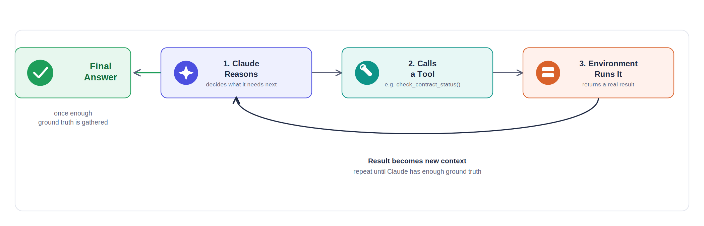
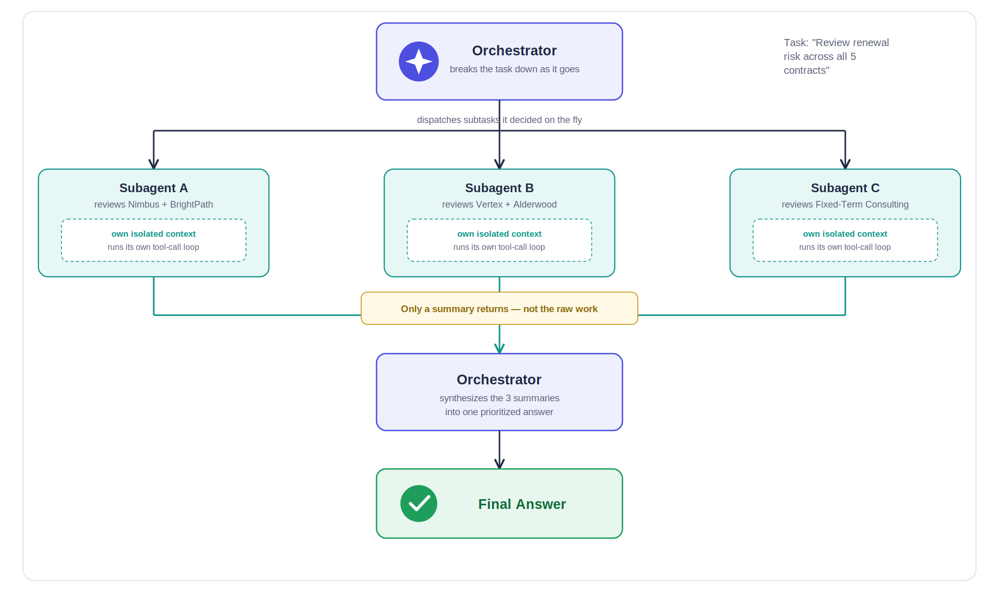

# Agentic Systems & Workflow Architecture — Student Lab Guide
### Module 8: Design Patterns for Production Agents

This module is grounded directly in Anthropic's own "Building Effective Agents" engineering post (Dec 2024) and its current successor, Claude Managed Agents (April 2026). Same setup as Module 4 — Console account, `ANTHROPIC_API_KEY`, `pip install anthropic`.

**Legend:** 🟢 Core (Workbench, minimal code) · 🔵 Stretch (real orchestration code)

**One framing worth internalizing before anything else:** Anthropic draws a hard line between two things people often lump together as "agents":
- **Workflows** — LLMs and tools orchestrated through code paths *you* define.
- **Agents** — LLMs that dynamically direct their own process and tool use.

Topics 2–4 below are workflow patterns (you control the path). Topics 5–7 move toward genuine agent territory (Claude controls more of the path). Topic 6 is where you'll explicitly practice choosing between them.

---

## 1. The Agent Loop: Tools, Thinking & Environment Inspection



**Basic theory:**
- The foundational building block isn't an "agent" — it's the **augmented LLM**: a model plus tools, retrieval, and memory. Every pattern in this module is this building block, composed differently.
- The **agent loop** is simple in mechanics: Claude calls a tool, the environment returns a real result (a file's contents, a command's output, a test's pass/fail), and that result — not Claude's assumption — becomes the basis for the next decision. Anthropic calls this getting "ground truth" from the environment.
- This is exactly Module 4's tool-use loop, just named for what it's doing architecturally: Claude never truly "knows" the state of anything outside the conversation until it inspects it.

### 🟢 Lab 1.1 — Watch the Loop Demand Ground Truth *(10 min)*
1. In the Workbench, with no tools defined, ask: `Does the Nimbus Cloud Services contract in my project currently have any pytest failures?`
2. Notice Claude can only guess or ask for the file — it has no way to actually check.
3. Now add the `check_contract_status` tool definition from Module 4 (wrapped in `{"type": "custom", "custom": {...}}` for the Workbench). Ask the same *kind* of question about contract status. This time Claude requests the tool instead of guessing — it's seeking ground truth before answering.

### 🔵 Lab 1.2 (Stretch) — A Loop That Actually Inspects Its Environment *(15 min)*
1. Save as `agent_loop_demo.py` — this extends Module 4's `tool_loop.py` pattern with a *second* real tool so Claude has to decide which one it needs:
   ```python
   from anthropic import Anthropic

   client = Anthropic()

   CONTRACTS = {
       "nimbus cloud services": {"end_date": "2026-09-25", "auto_renews": True, "notice_days": 30},
   }

   def check_contract_status(vendor_name: str) -> str:
       c = CONTRACTS.get(vendor_name.lower())
       return str(c) if c else "Not found."

   def get_todays_date() -> str:
       return "2026-08-01"  # fixed for this course's scenario

   tools = [
       {"name": "check_contract_status", "description": "Look up a contract by vendor name.",
        "input_schema": {"type": "object", "properties": {"vendor_name": {"type": "string"}}, "required": ["vendor_name"]}},
       {"name": "get_todays_date", "description": "Returns today's date.",
        "input_schema": {"type": "object", "properties": {}}},
   ]

   messages = [{"role": "user", "content": "Is the Nimbus contract's cancellation deadline already in the past?"}]

   for _ in range(4):  # loop until Claude stops requesting tools
       response = client.messages.create(model="claude-sonnet-5", max_tokens=500, tools=tools, messages=messages)
       messages.append({"role": "assistant", "content": response.content})
       if response.stop_reason != "tool_use":
           print(next(b.text for b in response.content if b.type == "text"))
           break
       results = []
       for block in response.content:
           if block.type == "tool_use":
               fn = {"check_contract_status": check_contract_status, "get_todays_date": get_todays_date}[block.name]
               result = fn(**block.input)
               print(f"  [environment inspected: {block.name}({block.input}) -> {result}]")
               results.append({"type": "tool_result", "tool_use_id": block.id, "content": result})
       messages.append({"role": "user", "content": results})
   ```
2. Run it: `python agent_loop_demo.py`. Watch the printed `[environment inspected: ...]` lines — this question genuinely needs *two* pieces of ground truth (today's date AND the contract data) before Claude can answer, and the loop keeps going until it has both.

---

## 2. Parallelisation Workflows & Chaining Patterns

**Basic theory:**
- **Prompt chaining**: decompose a task into a sequence of steps, each LLM call processing the previous one's output. Add a programmatic "gate" check between steps to catch drift before it compounds. Best for tasks that decompose cleanly — trading latency for accuracy.
- **Parallelization** has two variants: **sectioning** (split a task into independent pieces, run simultaneously) and **voting** (run the *same* task multiple times for diverse outputs, then aggregate). Best when subtasks are genuinely independent or when multiple perspectives increase confidence.

### 🟢 Lab 2.1 — Design a Chain on Paper *(8 min)*
1. Take the task: "produce a renewal-risk report for all 5 course contracts." Sketch it as a chain of 3 steps with a gate after step 2, e.g.: Step 1 (extract structured data from each contract) → **gate:** confirm all 5 have valid end dates → Step 2 (calculate risk per contract) → Step 3 (write the summary paragraph).
2. Identify which step, if it silently failed, would be hardest to catch without the gate.

### 🔵 Lab 2.2 (Stretch) — Voting in Code *(15 min)*
1. Save as `voting_demo.py` — 3 independent calls reviewing the same contract-review Skill output for accuracy, majority vote on whether it's correct:
   ```python
   from anthropic import Anthropic
   from collections import Counter

   client = Anthropic()

   claim = "Nimbus Cloud Services (ends Sept 25, 2026, 30-day notice) is 🟡 Monitor as of August 1, 2026."

   def vote():
       response = client.messages.create(
           model="claude-sonnet-5", max_tokens=100,
           messages=[{"role": "user", "content": f"Assume today is August 1, 2026. Is this claim's date math correct? Answer only CORRECT or INCORRECT.\n\n{claim}"}],
       )
       return next(b.text for b in response.content if b.type == "text").strip()

   votes = [vote() for _ in range(3)]
   print("Votes:", votes)
   print("Majority:", Counter(votes).most_common(1)[0][0])
   ```
2. Run it: `python voting_demo.py`. Even on a simple factual check, notice whether all 3 votes agree — if they don't, that disagreement is itself useful signal about how borderline the claim is.

---

## 3. Routing Workflows & Conditional Logic

**Basic theory:**
- Routing classifies an input, then sends it to a specialized downstream handler. This separates concerns — a prompt optimized for one input type doesn't have to also handle a completely different type.
- A common production use: route easy/common questions to a smaller, cheaper model (Haiku) and hard/unusual ones to a more capable model (Sonnet or Opus) — optimizing cost without sacrificing quality where it matters.

### 🔵 Lab 3.1 — Build a Cost-Aware Router *(18 min)*
1. Save as `router_demo.py`:
   ```python
   from anthropic import Anthropic

   client = Anthropic()

   def classify(question: str) -> str:
       response = client.messages.create(
           model="claude-haiku-4-5-20251001", max_tokens=20,
           messages=[{"role": "user", "content": (
               "Classify this question as SIMPLE (a direct lookup) or COMPLEX "
               f"(needs multi-step reasoning). Answer with one word.\n\n{question}"
           )}],
       )
       return next(b.text for b in response.content if b.type == "text").strip()

   def route(question: str):
       category = classify(question)
       is_simple = "SIMPLE" in category.upper()  # robust to punctuation like "SIMPLE."
       model = "claude-haiku-4-5-20251001" if is_simple else "claude-sonnet-5"
       print(f"[{category} -> routed to {model}]")
       response = client.messages.create(model=model, max_tokens=300, messages=[{"role": "user", "content": question}])
       return next(b.text for b in response.content if b.type == "text")

   print(route("What's the annual value of the Nimbus Cloud Services contract?"))
   print(route("Given all 5 course contracts, which combination of cancellations would save the most money this year while keeping at least one security-related vendor active?"))
   ```
2. Run it: `python router_demo.py`. Confirm the simple lookup routed to Haiku and the multi-constraint question routed to Sonnet — that's the cost/capability tradeoff working automatically instead of you manually picking a model every time.

---

## 4. Subagents for Task Decomposition



**Basic theory:**
- This is the **orchestrator-workers** pattern: a central LLM call breaks a task into subtasks *it decides on the fly*, dispatches them, and synthesizes the results. The key difference from parallelization: subtasks aren't pre-defined by you — the orchestrator determines them based on the actual input.
- This is the same conceptual pattern behind Module 7's Claude Code subagents, but built at the raw API level here — useful when you're not inside Claude Code and need the pattern in your own application.

### 🔵 Lab 4.1 — Orchestrator-Workers Over the Contract Set *(20 min)*
1. Save as `orchestrator_demo.py`:
   ```python
   from anthropic import Anthropic

   client = Anthropic()

   CONTRACTS = [
       "Nimbus Cloud Services, ends Sept 25 2026, auto-renews, 30-day notice.",
       "BrightPath Security Solutions, ends Oct 10 2026, auto-renews, 45-day notice.",
       "Vertex Networking Group, ends Nov 5 2026, auto-renews, 60-day notice.",
   ]

   # Orchestrator: decides what each worker should do (here, simplified to
   # "one worker per contract" -- a real orchestrator would decide this
   # dynamically based on task complexity)
   def worker(contract: str) -> str:
       response = client.messages.create(
           model="claude-sonnet-5", max_tokens=150,
           messages=[{"role": "user", "content": f"Assume today is August 1, 2026. In one sentence, state this contract's renewal risk: {contract}"}],
       )
       return next(b.text for b in response.content if b.type == "text")

   worker_results = [worker(c) for c in CONTRACTS]

   # Orchestrator: synthesizes worker outputs into one final result
   synthesis = client.messages.create(
       model="claude-sonnet-5", max_tokens=300,
       messages=[{"role": "user", "content": (
           "Synthesize these individual contract risk assessments into one "
           "prioritized action list:\n\n" + "\n".join(worker_results)
       )}],
   )
   print(next(b.text for b in synthesis.content if b.type == "text"))
   ```
2. Run it: `python orchestrator_demo.py`. Notice the structure: 3 independent worker calls, then one orchestrator call that never saw the raw contracts — only the workers' summaries. That's the same "keep verbose output out of the main context" principle from Module 7's subagents, implemented in raw API calls.

---

## 5. Managed Agents & the Developer Platform

**Basic theory:**
- **Managed Agents** is Anthropic's hosted service (public beta, launched April 2026) for long-running, stateful agent work — you define an **Agent** (model, system prompt, tools, MCP servers, skills) once, then run **Sessions** against it. Anthropic runs the harness, sandbox, and session persistence; you don't build any of it.
- This sits at a different point than everything else in this course: the raw Messages API (Module 4) means you run the loop yourself; the Agent SDK (Module 7) gives you Claude Code's harness as a library; **Managed Agents removes the harness from your infrastructure entirely** — it's cloud-hosted, resumable, and built for tasks running minutes to hours.
- Requires the `managed-agents-2026-04-01` beta header on raw API calls (the SDK sets this automatically).

### 🟢 Lab 5.1 — Onboard Through Claude Code *(10 min)*
The fastest path uses the same tool from Module 7:
1. Open Claude Code (`claude`) in any project.
2. Type: `start onboarding for managed agents in Claude API`
3. The built-in `claude-api` skill walks you through creating your first managed agent conversationally — this is the "no separate setup" path Anthropic points developers toward first.

### 🔵 Lab 5.2 (Stretch) — Create and Run One Directly *(15 min)*
1. If you have the `ant` CLI installed, create an agent:
   ```bash
   AGENT_ID=$(ant beta:agents create \
     --name "Contract Risk Assistant" \
     --model '{id: claude-sonnet-5}' \
     --system "You are a contract renewal risk analyst. Assume today is August 1, 2026 unless told otherwise.")
   ```
2. Start a session against it and give it a task referencing your course contract files:
   ```bash
   ant beta:agents sessions create --agent $AGENT_ID \
     --message "Review the 5 contract files in this directory and flag any needing action in the next 45 days."
   ```
3. Watch the streamed events as the session runs — note that this session is **stateful and resumable**: if you disconnect and reconnect, the harness on Anthropic's side keeps going, unlike a stateless Messages API call from Module 4.

**Debrief:** given everything you now know — raw Messages API, Agent SDK, Claude Code, Managed Agents — which would you reach for if you were building a Slack bot that answers quick questions? Which for an overnight batch job reviewing 500 contracts unattended?

---

## 6. Workflows vs Agents: Design Decision Framework — Workshop

**Basic theory:**
- Anthropic's own guidance, stated plainly: *"find the simplest solution possible, and only increase complexity when needed... optimizing single LLM calls with retrieval and in-context examples is usually enough."* Most tasks don't need any of Topics 2–5.
- **Use a workflow** (chaining, routing, parallelization) when the task decomposes into predictable, well-defined steps. **Use an agent** when the problem is open-ended, the number of steps can't be predicted in advance, and you can trust the model's judgment over many turns.
- Three principles for whichever you build: **simplicity**, **transparency** (show the planning steps, don't hide them), and a well-documented **agent-computer interface** — tool descriptions deserve as much care as your prompts.

### 🟢 Workshop — Classify 6 Scenarios *(25 min, groups of 3)*
For each, decide: single LLM call, which workflow pattern (chaining/routing/parallelization/orchestrator-workers), or a full agent — and justify in one sentence.

1. Translate a customer email, then check the translation preserves the original tone.
2. Handle incoming support tickets: general questions, refund requests, and technical bugs, each needing different tools and context.
3. Review a pull request for both security issues and style issues, where two different reviewers are more reliable than one that tries to do both.
4. Resolve a GitHub issue that could require changes to an unknown number of files, in ways that can't be predicted before looking at the codebase.
5. Answer "what's the capital of France" inside a customer support chat.
6. Migrate 2,000 files from one framework to another, where each file might need a different kind of change.

*(Compare answers across groups before checking: 1=chaining with a gate, 2=routing, 3=parallelization/sectioning, 4=orchestrator-workers or a full agent, 5=single LLM call — no pattern needed at all, 6=orchestrator-workers, similar to Module 7's `/batch` command.)*

**Debrief:** which scenario did your group disagree on most? That disagreement is usually a sign the task sits right on the boundary between two patterns — worth naming out loud, since real production tasks rarely fall neatly into one bucket either.

---

## 7. Built-in Tools, Skills & MCP in Agentic Context — Project

**Basic theory:**
- A production agent typically combines all three extension mechanisms from this course: **built-in/server tools** (code execution, web search — Module 4/5), **Skills** (reusable domain knowledge — Module 3/7), and **MCP servers** (external systems — Module 6). None of these are mutually exclusive.

### 🔵 Project — One Agent, Three Extension Types *(35 min)*
Combine Module 5's code execution, your `contract-review` Skill, and Module 6's MCP server into a single Managed Agent (or, if you don't have `ant` CLI access, simulate the same combination with the raw Messages API using `tools` for code execution + MCP-equivalent custom tools).

1. Define the agent's capabilities:
   - **Skill:** your `contract-review` Skill from Module 3, uploaded via the Skills API or Claude Code's `.claude/skills/`.
   - **MCP server:** your `contract_server.py` from Module 6, connected the same way as Lab 5.2 of Module 7.
   - **Built-in tool:** code execution, for any calculation across the contract set that the Skill's logic alone can't handle (e.g., an aggregate statistic across all 5).
2. Give it one task that would need all three: `Using the contract-review approach, the MCP contract lookup, and code execution for the math, tell me the total annual value we'd retain if we let every 🟡 or 🔴 contract lapse instead of renewing.`
3. Trace which extension type handled which part of the answer — the Skill likely shaped the risk classification, the MCP tool supplied the raw data, and code execution did the arithmetic.

**Course debrief:** across Modules 1–8, you've gone from typing a first message into Claude to designing which of five workflow patterns fits a production task, and knowing when none of them should be used at all. What's the one architectural decision from this module you're most likely to get wrong on a real project — and what would make you catch it?
