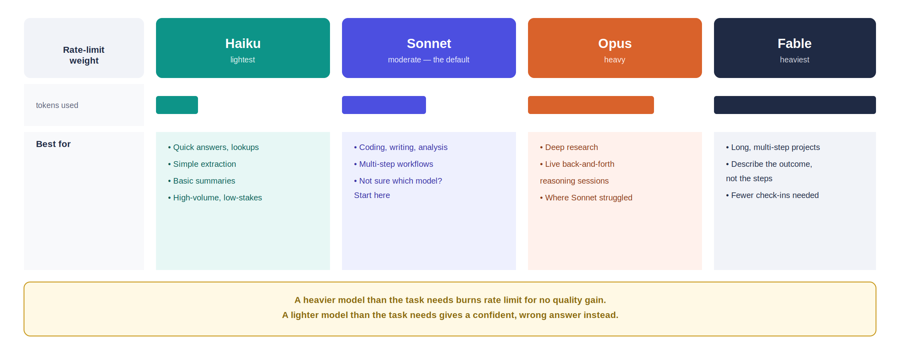
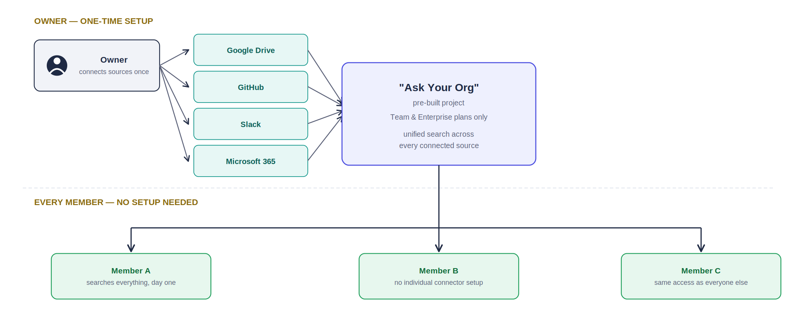
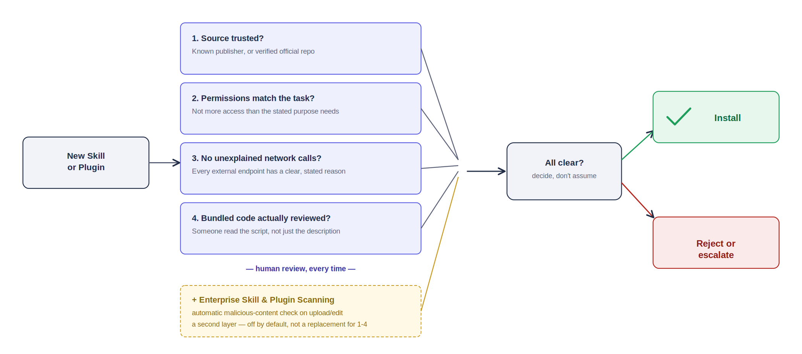
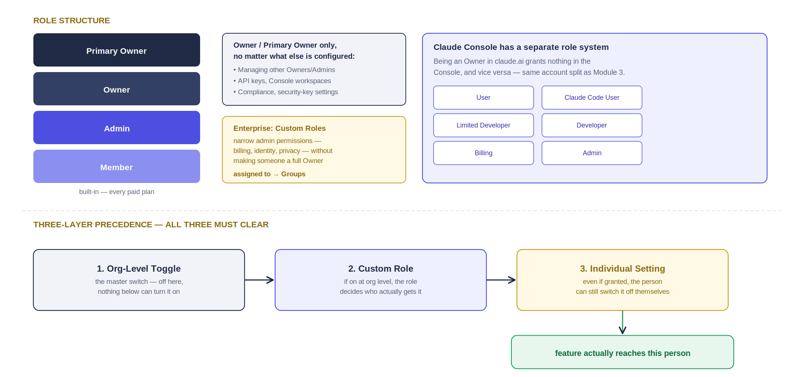

# Enterprise Integration & Deployment — Student Guide
### Module 9: Rolling Claude Out Across an Organization

Different flavor from every module before this one — no code today. This module is about organizational decisions: which model to use, how real companies actually deployed Claude, and how to govern access safely at scale. Grounded throughout in Anthropic's own published guidance and real, attributed customer case studies — not invented examples.

**Legend:** 🟢 Workshop (group exercise) · 📖 Case Study (read + discuss) · 🔵 Lab (hands-on where your org allows it)

---

## 1. Choosing the Right Claude Model for the Task — Workshop

**Basic theory, straight from Anthropic's own model selection guide:**
- **Haiku** — lightest rate-limit use. Quick answers, summaries, simple extraction — anything you want done instantly.
- **Sonnet** — moderate use, the daily driver. Coding, writing, analysis, multi-step workflows. If you're not sure which model to pick, start here.
- **Opus** — heavy use, a reasoning specialist. Deep research and complex reasoning that genuinely needs sustained thinking, live back-and-forth sessions, problems where Sonnet struggled.
- **Fable** — heaviest use, the most capable tier. Long, complex, multi-step projects Claude can plan and check itself on with fewer mid-task check-ins — describe the outcome, not the steps.

The core mistake Anthropic calls out directly: using a heavier model than a task needs doesn't just cost more — it burns through your organization's rate limit for no quality gain. The reverse is just as real: using Haiku on something that needs Opus-level reasoning produces answers that look confident and are wrong.

### 🟢 Workshop — Assign the Right Model *(20 min, groups of 3)*
For each task, pick Haiku, Sonnet, Opus, or Fable, and justify in one sentence:

1. Summarize this week's 40 support tickets into one paragraph for a standup.
2. Draft a first-pass architecture doc for a new microservice from a rough outline.
3. Review a 200-page vendor contract for every clause that conflicts with company policy, then draft redlines.
4. Answer "what's our PTO policy" from an internal FAQ.
5. Take a one-paragraph goal — "modernize our legacy billing system" — and plan, execute, and self-check a multi-week migration with minimal check-ins.
6. Classify 10,000 inbound leads as hot/warm/cold based on a form response.

*(Compare answers across groups before checking: 1=Haiku, 2=Sonnet, 3=Opus, 4=Haiku, 5=Fable, 6=Haiku — cost matters at that volume even though each individual classification is easy.)*

**Debrief:** which task did your group disagree on most — and was the disagreement about task complexity, or about how much you trust the model to work unsupervised? Those are different questions with different answers.

---

## 2. Claude in Action: Use Cases by Role — Case Studies

Three real, named deployments — not composites, not hypotheticals. Read each, then discuss.

### 📖 Case Study: Zapier
Zapier's Lead Product Manager of AI, Reid Robinson, frames their approach around a core belief: the company has always focused on helping people become builders. Adoption started from the ground up — marketing employees using Claude for personal productivity long before any company-wide rollout. From there it spread by role:
- **Marketing:** the product marketing team uses Claude for blog posts, social content, and keynote presentations, with an automated pipeline where Claude drafts content, saves it to Google Docs, and pings the team in Slack for review.
- **Engineering:** Claude Code handles everyday code generation, and their CTO built a workflow where reacting to a Slack thread with an emoji triggers Claude to read the context, write code, and open a merge request — all within minutes.
- **Design:** designers use Claude artifacts to prototype live during customer interviews, turning a weeks-long process into something they can show in the room.

### 📖 Case Study: NBIM (Norway's $1.7T Sovereign Wealth Fund)
NBIM's CEO set an unambiguous tone for adoption — employees needed to "get on the train or be left at the station." What makes this case study worth studying isn't the enthusiasm, it's the *rollout mechanics*: a 2-week pilot expanded to 600+ active users within two months, backed by an "AI Ambassador Network" — 50 employees trained deeply and meeting regularly to share what worked. The organizational challenge: their users range from portfolio managers who code to compliance staff who don't, all needing to analyze ESG factors across 9,000 portfolio companies. The line worth sitting with, from Head of ML and AI Stian Kirkeberg: extending Claude Code to business analysts and quant researchers, not just engineers, let them build their own workflows within governance controls, without waiting on IT. That's Topic 5 of this module in one sentence — governance that enables self-service instead of blocking it.

### 📖 Case Study: NRI (Japan)
NRI evaluated multiple AI models against **custom tests built from real Japanese business operations** — not standard benchmarks — before selecting Claude for a specialized terminology review system. The result: a 50% cut in document review time. AI-CoE lead Yuki Kitamura's stated reason for the pick: Claude followed complex instructions on distinctively formatted Japanese business documents better than competitors.

### 🟢 Discussion *(15 min, whole group)*
1. All three companies started with a narrow pilot before any org-wide rollout. What's the risk of skipping that step?
2. NBIM explicitly extended Claude Code beyond engineers. Given what you learned about Claude Code in Module 7, what would you need in place — training, guardrails, review process — before doing the same at your own organization?
3. Which of these three role patterns (marketing content pipeline, dev-tool-for-everyone, benchmark-driven model selection) is closest to how your own organization would actually adopt Claude first?

---

## 3. Enterprise Search & Knowledge Management — Lab

**Basic theory:**
- Enterprise Search is a real, specific feature — not a generic description of "search your company data." It ships as a pre-built project called **"Ask Your Org,"** available on Team and Enterprise plans.
- Setup is centralized: **an Owner connects the data sources once** — Google Drive, GitHub, Slack, Microsoft 365, and others — through a guided onboarding flow. After that, it's available to every member of the organization automatically, with no per-person setup.
- This is the same connector mechanism from Module 6's MCP work, just centrally provisioned instead of individually connected — the org-wide version of what you did by hand with `claude mcp add`.

### 🔵 Lab — Explore Ask Your Org *(15 min — access-dependent)*
1. If your organization is on a Team or Enterprise plan and has this enabled: open Claude and look for **"Ask Your Org"** in the left sidebar. Ask it a real question that spans two connected sources (e.g., "what did we discuss about the Nimbus contract in Slack, and is there a related file in Drive?").
2. If it's not enabled yet, or you're on a different plan: walk through the setup flow with your instructor as a guided tour instead — an Owner would go to the connector onboarding screen, connect each data source once, and the rest of the org inherits access automatically.
3. Either way, answer: what's the practical difference between this and having every employee individually connect their own Google Drive via Module 6-style MCP connectors? Where does the trade-off between centralized control and individual flexibility actually matter?

---

## 4. Safety Best Practices & Validating Skills for Plugins — Workshop

**Basic theory:**
- A Skill or plugin from outside your organization can look completely reasonable and still misuse the access it's granted — this isn't a hypothetical, it's the exact reason Anthropic ships **skill and plugin scanning**: an Enterprise-plan beta feature that automatically checks third-party skills and plugins for malicious content the moment someone uploads or edits them, before they can run.
- Scanning is off by default — an Owner or Primary Owner turns it on under **Organization settings → Skills**.
- Scanning is a second layer, not a replacement for human review. The real risk categories worth checking for yourself, beyond what any automated scan catches: credential or data exfiltration, prompt injection embedded in instructions, requests for permissions broader than the Skill's stated purpose ("scope creep"), and any bundled script that executes shell commands or reaches out to an unfamiliar network endpoint.

### 🟢 Workshop — Review Before You Install *(20 min, groups of 3)*
For each Skill description, decide: install, reject, or "needs more review" — and name the specific red flag if you reject it.

1. A `contract-review` Skill (like the one you built in Module 3) that reads uploaded contract text and returns a risk classification, with no external network calls.
2. A "productivity booster" Skill whose `SKILL.md` requests filesystem write access and an API key for an analytics service you've never heard of, to "improve suggestions over time."
3. A well-known open-source PDF-processing Skill with 40,000 GitHub stars, unmodified, from the official maintainer's repository.
4. A Skill shared internally by a colleague that includes a bundled script silently sending a copy of every processed document to an external webhook, described only as "logging."
5. A Skill that asks for broad email access to "help with scheduling," when the task it's actually built for only needs to read calendar availability.

*(Compare group answers before checking: 1=install, 2=reject — scope creep plus an unverified endpoint, 3=install after checking it's genuinely the unmodified official source, 4=reject — undisclosed data exfiltration, 5=needs more review — request access matching the actual task, not more.)*

**Debrief:** which of these would automated scanning likely catch on its own, and which genuinely needs a human reading the permissions request? That gap is exactly why scanning is a floor, not a ceiling.

---

## 5. Team Sharing, Role-Based Access & Governance — Workshop

**Basic theory:**
- The built-in role structure, available on every paid org plan: **Primary Owner, Owner, Admin, Member.** Some things stay Owner/Primary-Owner-only no matter what else is configured — managing other Owners and Admins, API keys and Console workspaces, compliance and security-key settings.
- **Enterprise adds custom roles**, which work alongside **groups**. A custom role can grant narrow admin permissions — billing, identity, privacy — without making someone a full Owner. Roles get assigned to groups; members inherit the union of every group they're in.
- **Three-layer precedence, worth memorizing exactly in this order:** ① an organization-level toggle is the master switch — if a feature is off here, no custom role can turn it on for anyone; ② if it's on at the org level, custom roles determine who gets it; ③ even if a role grants it, an individual member can still turn it off in their own settings. A feature must clear all three layers to actually reach a specific person.
- **The Claude Console has an entirely separate role system** from claude.ai's org roles — six of them (User, Claude Code User, Limited Developer, Developer, Billing, Admin), scoped to API/developer access. This is the same claude.ai-vs-Console account split from Module 3, showing up again at the governance layer: being an Owner in claude.ai grants you nothing in the Console, and vice versa.

### 🟢 Workshop — Design a Rollout *(25 min, groups of 3)*
Your company is piloting Claude Enterprise with these groups: **Engineering** (60 people, need Claude Code + API access), **Finance** (12 people, need Enterprise Search + Claude access, must never see engineering's connectors), **IT Admins** (3 people, need to manage connectors and billing but shouldn't be able to remove the Primary Owner), and **Everyone else** (400 people, need base Claude access only).

Sketch a role/group design covering:
1. Which of the four groups above needs a **custom role** versus which can use a built-in role as-is?
2. Where would you set the skill/plugin scanning toggle — org-level only, or does it need a custom role layered under it too?
3. IT Admins need real administrative power but must never touch Owner-level settings. Which specific things stay out of reach for them no matter what their custom role grants, per this module's theory section?
4. Given NBIM's case study from Topic 2 — extending Claude Code to non-engineers "within governance controls" — sketch how you'd extend Engineering-tier access to one or two people in Finance without giving them everything Engineering has.

**Debrief:** compare your group's design to another group's. Where did you disagree on which layer (org toggle, custom role, or individual setting) should carry the restriction? That disagreement is usually a sign the requirement itself was ambiguous — worth naming which one, and how you'd actually go find the answer before building this for real.

---

**Course debrief:** across all nine modules, you've gone from a first prompt to designing organizational governance for a few hundred people. What's the one module you'd want to revisit before rolling any of this out for real — and what's the specific gap you'd want to close first?
