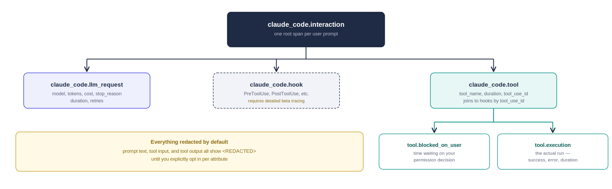
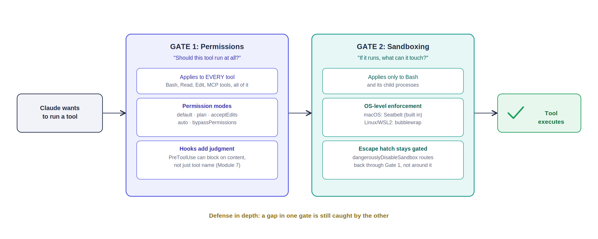
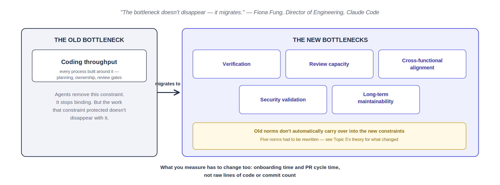

# Observability, Guardrails & the AI-Native Operating Model
### Module 10: Running Claude in Production, Long-Term

The final module. Three labs on the technical machinery of production operation, two workshops on the organizational shifts that come with it, and a closing set of case studies to help you make — and defend — the business case. Every technical claim below is grounded in Anthropic's own current documentation; every organizational claim is grounded in a real, named source, not invented best practice.

**Legend:** 🔵 Lab (hands-on) · 🟢 Workshop (group exercise) · 📖 Case Study (read + discuss)

---

## 1. Production Observability: Logging, Tracing & Monitoring Agent Runs — Lab



**Basic theory:**
- Claude Code ships OpenTelemetry support (currently beta) across three signal types: **metrics** (time-series counters — sessions, cost, tokens, lines of code), **logs/events** (discrete records — a prompt submitted, a tool completed, a permission decision made), and **traces** (the full shape of one interaction, span by span).
- Every event carries redaction by default. Prompt text, tool inputs, and response content are all `<REDACTED>` unless you explicitly opt in with `OTEL_LOG_USER_PROMPTS`, `OTEL_LOG_TOOL_DETAILS`, or `OTEL_LOG_TOOL_CONTENT` — production observability and data privacy aren't in tension by default, they're separately configurable.
- The `prompt.id` attribute is the thread that ties everything together: one user prompt can trigger multiple API calls and tool runs, and every event from that prompt carries the same `prompt.id`, letting you reconstruct the whole turn.

### 🔵 Lab 1.1 — Turn On Telemetry, Watch It Live *(15 min)*
1. In your `sample-repo-failing-test` project (from Module 2/7), enable telemetry with the console exporter — no external backend needed for this lab:
   ```bash
   export CLAUDE_CODE_ENABLE_TELEMETRY=1
   export OTEL_METRICS_EXPORTER=console
   export OTEL_LOGS_EXPORTER=console
   export OTEL_METRIC_EXPORT_INTERVAL=5000
   claude
   ```
2. Ask Claude to fix the off-by-one bug in `contract_alerts.py`, same as Module 2. Watch the console output.
3. Find the `claude_code.session.count` metric (confirms a session started) and the `claude_code.user_prompt` event (confirms your prompt was logged). Notice the prompt text itself is redacted — that's the default, not a bug.

### 🔵 Lab 1.2 (Stretch) — Read the Span Hierarchy *(15 min)*
1. Enable trace export as well:
   ```bash
   export CLAUDE_CODE_ENHANCED_TELEMETRY_BETA=1
   export OTEL_TRACES_EXPORTER=console
   claude
   ```
2. Ask a question that requires a tool call (e.g., "what does contract_alerts.py do?"). In the console output, find the `claude_code.interaction` root span, then trace its children down to a `claude_code.tool` span, and that span's own two children: `claude_code.tool.blocked_on_user` (time spent waiting on your permission decision) and `claude_code.tool.execution` (the actual run).
3. Match this against the diagram above. This span shape is the same one a real observability backend (Grafana, Datadog, your own OTel collector) would show you for a production agent fleet — you just read it from a terminal instead of a dashboard this time.

**Debrief:** if you were running Claude Code across a 200-person engineering org, which single metric from today would you put on the first dashboard tile, and why that one over the others?

---

## 2. Guardrails: Permission Scopes, Sandboxing & Human-in-the-Loop Checkpoints — Lab



**Basic theory:**
- Two genuinely separate systems, not one: **permissions** decide whether a tool runs at all, evaluated before every tool call — Bash, Read, Edit, MCP tools, everything. **Sandboxing** is OS-level enforcement of what a Bash command can actually touch — filesystem and network — and applies only to Bash and its child processes.
- Sandboxing runs on macOS (built-in Seatbelt, nothing to install) and Linux/WSL2 (bubblewrap). Native Windows isn't supported — you need WSL2.
- Two sandbox modes: **auto-allow** (sandboxed commands run without a prompt, since the sandbox itself is the safety boundary) and **regular permissions** (still prompts for every command, but you see fewer false alarms since anything the sandbox would block just fails outright instead of asking).
- The escape hatch: when a command can't run inside the sandbox (needs an unlisted host, for instance), Claude can retry it with `dangerouslyDisableSandbox` — which routes it back through the *regular* permission flow, so a human still approves it. Sandbox restrictions don't silently disappear; they downgrade to a human checkpoint.

### 🔵 Lab 2.1 — Compare the Two Layers Directly *(15 min)*
1. In your project, check your current permission mode: `/permissions`. Note what's currently allowed/denied.
2. Run `/sandbox` to open the sandbox panel. Look at the **Mode** tab (auto-allow vs. regular) and the **Config** tab (resolved filesystem/network rules).
3. Ask Claude to run `cat ~/.ssh/id_rsa` (or an equivalent sensitive-path read on your OS). Confirm the sandbox blocks this at the filesystem layer — independent of whatever your permission mode says about Bash generally.
4. Ask Claude to `curl` an arbitrary external domain you haven't allowlisted. Confirm it's blocked at the network layer, then watch what happens if Claude retries with the escape hatch — you should still see a human approval prompt, not a silent bypass.

### 🔵 Lab 2.2 (Stretch) — Add a Human-in-the-Loop Checkpoint for a Real Risk *(15 min)*
1. Recall Module 7 Lab 6.1's `PreToolUse` hook blocking direct edits to `test_contract_alerts.py`. Extend it: add a second hook that specifically flags any Bash command containing `rm -rf`, `git push --force`, or a database connection string pattern — regardless of what the sandbox or permission mode would otherwise allow.
2. Test it. Confirm the hook fires even in `acceptEdits` or auto-allow mode — a well-placed hook is a checkpoint that neither permissions nor sandboxing alone will give you, since it can encode judgment specific to your own risk model.

**Debrief:** name one action in your own real workflow that should *always* require a human checkpoint, no matter how much you trust the model otherwise. Which of today's three mechanisms — permission rule, sandbox restriction, or custom hook — is actually the right tool for that specific case?

---

## 3. Feedback Loops: Eval Regression & Continuous Improvement — Lab


**Basic theory, from Anthropic's own published eval guidance:**
- **Capability evals** measure how far an agent's abilities extend — are we getting better at the hard stuff? **Regression evals** verify that behavior which already works keeps working — did today's change quietly break yesterday's fix? Production teams need both, because they answer different questions and support different decisions.
- The standard lifecycle: a capability eval that reaches a high, stable pass rate **graduates** into the regression suite. It stops being a stretch goal and becomes a guarantee you're now protecting.
- Grade the outcome, not the path. Checking exact tool-call sequences makes evals brittle to any legitimate refactor and penalizes valid approaches the eval's author didn't anticipate — grade whether the task was actually accomplished.
- Start small and real: 20-50 cases pulled from actual production failures teach you more than 1,000 synthetic ones, because they're calibrated against real user pain instead of imagined scenarios.

### 🔵 Lab 3.1 — Build a Regression Case From a Real Failure *(15 min)*
1. Recall the off-by-one bug from Module 2's `contract_alerts.py` — a real failure you already have. Using Module 3's grading patterns, write a regression eval case for it:
   ```python
   # regression_cases.py
   REGRESSION_CASES = [
       {
           "id": "off_by_one_days_until",
           "input": "Given a contract ending 2026-09-25 with 30 days notice, "
                     "assume today is 2026-08-01. Is the cancellation deadline "
                     "already past?",
           "expected_outcome": "not past — deadline is 2026-08-26, 25 days from today",
           "graded_on": "outcome",  # not the specific steps taken to get there
       },
   ]
   ```
2. This single case is what "graduating a capability eval into a regression suite" actually looks like in practice — not a new tool, just a deliberate decision to keep testing something that used to be broken.

### 🔵 Lab 3.2 (Stretch) — Model-Graded Regression Check *(15 min)*
1. Reuse Module 3's model-based grader pattern (`grade_model.py`) against the case above. Run it after any prompt or code change to `contract_alerts.py`, treating a failing grade as a build-breaking regression, not a suggestion.
2. Add one negative case — an input where the correct behavior is for Claude to say the deadline *has* passed. Anthropic's own guidance is explicit here: one-sided eval suites (only testing "should happen," never "shouldn't happen") produce one-sided, overconfident agents.

**Debrief:** your team ships a new system prompt for the contract-review Skill next week. Walk through, out loud, exactly which of today's cases would catch a regression versus which would stay silent — and what that gap tells you about your current suite's blind spots.

---

## 4. Maintaining Skills, Subagents & CLAUDE.md Over Time — Workshop

**Basic theory:**
- Everything you built in Modules 3, 6, and 7 — Skills, MCP servers, subagents, CLAUDE.md — was designed once. None of it stays correct forever. Models change, your codebase changes, your org's risk tolerance changes, and instructions that were precise six months ago quietly drift into noise.
- Three concrete staleness signals worth watching for, not waiting for someone to notice by accident:
  - **A model upgrade changes behavior** — a CLAUDE.md workaround for an old model's weakness can become unnecessary clutter, or worse, actively counterproductive, once the weakness is fixed.
  - **A regression eval starts failing without a code change** — from Topic 3, that's model drift or environment drift, and it's exactly the kind of thing a maintained regression suite catches that casual use won't.
  - **Nobody can explain why a rule exists** — same instinct as Module 9's Skill safety review, but pointed inward at your own accumulated instructions instead of a third party's.

### 🟢 Workshop — Audit Your Own Course Artifacts *(20 min, groups of 3)*
Pull out the `contract-review` Skill (Module 3), the `contract_server.py` MCP server (Module 6), and any CLAUDE.md or subagent you built in Module 7. For each:
1. If Claude Sonnet 5 became Claude Sonnet 6 tomorrow, is there anything in this artifact that exists specifically to work around a limitation of the current model? Flag it.
2. Is there an instruction in here nobody in your group can currently justify? That's a deletion candidate, not a keep-just-in-case.
3. Does this artifact have a regression eval protecting it (Topic 3), or is its correctness currently resting entirely on "it worked when I tested it once"?

**Debrief:** which of your three artifacts is most at risk of silent drift, and what's the cheapest possible check you could add this week to catch it — not the ideal solution, the cheapest one you'd actually ship?

---

## 5. The AI-Native Operating Model: Restructuring Roles & Review Processes — Workshop



**Basic theory**, from a real internal account: Fiona Fung, Anthropic's Director of Engineering for Claude Code, describing how her own team's operating model changed as agentic coding went from individual tool to organizational default:

- **The central claim: bottlenecks migrate, they don't disappear.** For decades, engineering bandwidth was the scarce resource, and every process — planning cadence, code ownership, review gates — was built around that constraint. Once agents can generate, refactor, and test at speed, that constraint stops binding. The new ones: verification, review capacity, cross-functional alignment, security validation, and long-term maintainability.
- **Five norms her team rewrote:**
  1. Planning went from six-month roadmaps to just-in-time — rapid prototyping validated with real users before over-committing to a direction.
  2. Code review shifted from gatekeeping to trust-but-verify — Claude handles style, linting, basic bugs; humans focus on architecture, security boundaries, and product judgment.
  3. "Who wrote this?" stopped being the useful question. "What problem does this solve, and how do we verify it?" replaced it.
  4. Hiring shifted toward taste and systems thinking over raw coding throughput, since execution speed is no longer the differentiator.
  5. Org structure stayed flat, and every manager still codes — a deliberate "dogfooding" requirement so leadership decisions stay grounded in how the tools actually behave, not abstraction.
- **What she measures instead of raw velocity:** onboarding time, PR cycle time, and how universal AI-assisted work has become — explicitly *not* lines of code or commit count, which reward the wrong behavior.

### 🟢 Workshop — Apply the Five Norms to Your Own Org *(25 min, groups of 3)*
For each of Fung's five norms, answer for your own actual team or organization:
1. Which of the five is already true for you, even informally?
2. Which one would meet the most resistance if you proposed it next week — and is that resistance about the process itself, or about who currently holds authority under the old version of it?
3. Pick one norm and sketch the single smallest concrete change that would move your team toward it — not the full transformation, the first real step.

**Debrief:** Fung's team set three non-negotiables (everyone uses the tool, automate what can be automated, explicit permission to kill outdated process) and left everything else to individual team autonomy. Would that same top-down/bottom-up split work at your organization, or does your context need a different line drawn between mandate and autonomy?

---

## 6. Business Case Closure: ROI, Adoption Metrics & Executive Sign-off — Case Studies

**The metrics that actually survive an executive conversation** aren't usage statistics — "we sent 10,000 prompts this month" answers a question nobody asked. What holds up is business and engineering outcomes: cycle time, defect rate, review rework, cost per unit of output, adoption depth versus adoption breadth. Revisit Module 9's three case studies with that lens:

### 📖 Revisit: The Numbers That Actually Closed the Business Case
- **NBIM** didn't lead with "we use Claude." They led with **600+ active users within two months of a two-week pilot**, and **20%+ weekly time savings measured through internal surveys** — an adoption-depth number and a productivity number, not a vanity metric.
- **NRI** didn't claim "Claude is smart." They measured **document review time cut by 50%**, against custom benchmarks built from real Japanese business operations — a baseline-before, measured-after comparison, exactly the structure Module 9's theory called for.
- One more, from Anthropic's own published case studies: **HackerOne reduced vulnerability response time by 44%** using Claude for security work — a single, specific, defensible operational metric, not a broad productivity claim.

### 🟢 Workshop — Draft Your Own Closing Slide *(20 min, groups of 3)*
Using this course's own contract-review scenario as your pilot: sketch the three numbers you'd put in front of an executive to close the business case, following the pattern above exactly:
1. **A baseline number** — what did contract review cost (time, headcount, error rate) before any of this course's tooling?
2. **An adoption number** — not "we built it," but real usage: how many contracts actually ran through the Module 5 RAG pipeline or the Module 3 Skill, by how many people, over what period?
3. **An outcome number** — the actual business metric that moved: time saved, deadlines caught that would have been missed, dollars retained by not auto-renewing a contract that should have lapsed.

**Course closing debrief:** across all ten modules, which single lab or workshop would you actually walk into your own leadership's office and demo first — not the most impressive one, the one most likely to get you a "yes" to do more?
