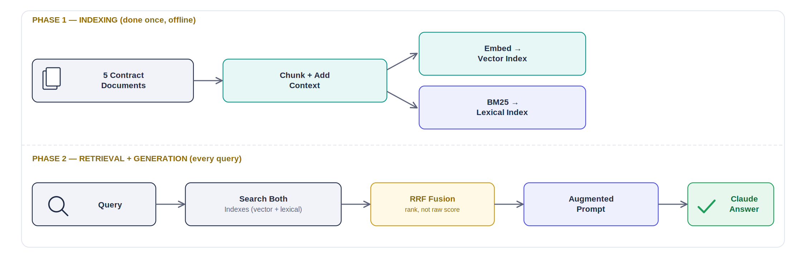
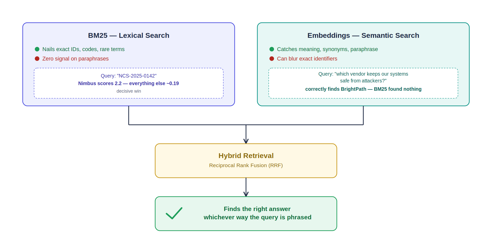

# RAG & Knowledge Architecture — Student Lab Guide
### Module 5: Building Retrieval Systems for Claude

Same Console/API setup as Modules 3–4. This module adds one new dependency: **Voyage AI**, Anthropic's recommended embeddings partner (a separate company — Voyage was acquired by MongoDB, not Anthropic, so this is genuinely a second account and a second API key, same pattern as the claude.ai/Console split from Module 3).

```bash
pip install voyageai rank_bm25 numpy
export VOYAGE_API_KEY="<your Voyage key from dashboard.voyageai.com>"
```

**Legend:** 🟢 Core (reasoning/prediction, minimal code) · 🔵 Stretch (real Python scripts)

**Running scenario, extended:** today we stop pasting contract text into prompts by hand (what every prior module did) and build an actual system that *finds* the right contract automatically. All labs use the same 5 course contracts — small enough to reason about by hand, which is exactly what makes it possible to verify whether your retrieval system is actually working.

---

## 1. Introduction to Retrieval-Augmented Generation
**Format: Reading — no lab, just the concept, ~10 min**



**What RAG actually is:** three steps, in order. **Retrieve** — find the documents (or chunks of documents) relevant to a question. **Augment** — insert what you found into the prompt as context. **Generate** — Claude answers using that context instead of its own memory.

**Why it exists at all, given Claude's context window is already huge:**
- **Cost.** Re-sending your entire knowledge base on every single question is wasteful when only a handful of documents are ever relevant to a given question.
- **Scale.** A 200K-token context window sounds enormous until your knowledge base is thousands of documents, not 5 contracts.
- **Precision.** Irrelevant context doesn't just cost tokens — it can dilute Claude's answer quality, the same way a vague prompt does.

**The real numbers, from Anthropic's own research:** in September 2024, Anthropic published "Contextual Retrieval," measuring retrieval failure rates on a real benchmark. Their findings, layer by layer:
- Traditional chunking + embeddings alone: **5.7%** retrieval failure rate
- Adding context to each chunk before embedding ("contextual embeddings"): **3.7%** (35% reduction)
- Adding contextual BM25 (keyword search) on top: **2.9%** (49% reduction)
- Adding a final reranking step: **1.9%** (67% reduction from baseline)

That progression — chunking → embeddings → BM25 → combining them → reranking — is exactly the order this module is structured in. Each lab below is one layer of that real, published result.

**Check your understanding (no code, just think it through):** if you were building a RAG system over 10,000 vendor contracts instead of 5, which of the three RAG steps (Retrieve, Augment, Generate) would break first if you skipped it entirely? Which would degrade silently instead of failing loudly — meaning you might not notice it's broken until someone gets a wrong answer?

---

## 2. Text Chunking Strategies for Production RAG

**Basic theory:**
- Chunking means splitting documents into smaller pieces before indexing, since retrieval works better on focused pieces than whole documents.
- Naive chunking (cut every N characters) is fast but can slice a contract mid-sentence — "ripping pages out of a book at random."
- Better strategies respect natural boundaries (paragraphs, clauses, sections) instead of a fixed character count.
- **Contextual chunking** (Anthropic's technique from the reading above): before indexing a chunk, prepend a short, LLM-generated summary of where this chunk sits in the whole document. A chunk that just says "$63,000/year" is useless alone; "This is the annual value from the Nimbus Cloud Services contract: $63,000/year" is retrievable.

### 🟢 Lab 2.1 — Chunk One Contract by Hand *(10 min)*
1. Take the Nimbus Cloud Services contract text. Chunk it two different ways:
   - **Naive:** cut it into 3 roughly-equal pieces by character count, wherever that lands.
   - **Boundary-aware:** cut it by natural fields instead — one chunk for vendor/reference info, one for renewal terms, one for value/contact.
2. Look at your naive chunks. Is there one that, read alone with no other context, wouldn't tell you which vendor it's even about?
3. That's the exact failure mode contextual chunking exists to fix.

### 🔵 Lab 2.2 (Stretch) — Contextual Chunking in Code *(15 min)*
1. Save as `contextual_chunk.py`:
   ```python
   from anthropic import Anthropic

   client = Anthropic()

   full_contract = """Nimbus Cloud Services. Contract NCS-2025-0142. Effective
   Sept 25 2025. Provides primary cloud infrastructure hosting including
   compute, storage, and managed database services. Auto-renews for
   successive 12-month terms unless either party provides written notice
   of cancellation at least 30 days before the end date. Annual value
   $63,000."""

   bare_chunk = "Auto-renews for successive 12-month terms unless either party provides written notice of cancellation at least 30 days before the end date."

   response = client.messages.create(
       model="claude-sonnet-5",
       max_tokens=100,
       messages=[{
           "role": "user",
           "content": (
               f"Full document:\n{full_contract}\n\n"
               f"Chunk to contextualize:\n{bare_chunk}\n\n"
               "Write a one-sentence context (50-100 tokens) that situates "
               "this chunk within the document. Prepend it to the chunk. "
               "Output only the final contextualized chunk, nothing else."
           ),
       }],
   )
   print(next(b.text for b in response.content if b.type == "text"))
   ```
2. Run it: `python contextual_chunk.py`. Compare the bare chunk to the contextualized one — the contextualized version is what actually gets embedded and indexed in a real pipeline, not the bare fragment.

---

## 3. Text Embeddings & Vector Search

**Basic theory:**
- An embedding is a list of numbers (a vector) representing a piece of text, positioned so that texts with *similar meaning* end up *close together* in that vector space — even if they don't share any exact words.
- **Anthropic doesn't provide its own embedding model** — the recommended provider is Voyage AI, a separate company (acquired by MongoDB) with its own API and key.
- **Cosine similarity** measures how close two vectors are — the standard way to rank "which documents are most relevant to this query."
- Vector search workflow: embed every chunk once, ahead of time (indexing). At query time, embed just the query, compare it against every stored chunk vector, return the closest matches.

### 🟢 Lab 3.1 — Predict Before You Compute *(8 min)*
1. Without running anything, read this query: `"Which vendor helps keep our systems safe from attackers?"`
2. Looking at the 5 course contracts' descriptions, which one should a *good* semantic search return, even though the query shares almost no exact words with that contract's text?
3. Hold onto your answer — Lab 4.1 will show you what a purely keyword-based search does with this exact same query, and it won't be what you'd expect.

### 🔵 Lab 3.2 (Stretch) — Real Embeddings and Ranking *(18 min)*
1. Save as `embed_search.py`:
   ```python
   import numpy as np
   from voyageai import Client

   voyage = Client()

   contracts = {
       "Nimbus Cloud Services": "Provides primary cloud infrastructure hosting including compute, storage, and managed database services for production workloads.",
       "BrightPath Security Solutions": "Provides endpoint security tooling, vulnerability scanning, and quarterly compliance reporting.",
       "Vertex Networking Group": "Provides managed WAN circuits and telecom support across all regional offices.",
       "Alderwood Office Supplies": "Supplies IT peripherals, cabling, and consumables for the office and data closet.",
       "Fixed-Term Consulting LLC": "Provides contract engineering support for the infrastructure modernization project.",
   }

   names = list(contracts.keys())
   docs = list(contracts.values())

   doc_result = voyage.embed(docs, model="voyage-4", input_type="document")
   doc_vectors = np.array(doc_result.embeddings)

   query = "Which vendor helps keep our systems safe from attackers?"
   query_result = voyage.embed([query], model="voyage-4", input_type="query")
   query_vector = np.array(query_result.embeddings[0])

   def cosine_similarity(a, b):
       return np.dot(a, b) / (np.linalg.norm(a) * np.linalg.norm(b))

   scores = [cosine_similarity(query_vector, v) for v in doc_vectors]
   ranked = sorted(zip(names, scores), key=lambda x: -x[1])

   print(f"Query: {query}\n")
   for name, score in ranked:
       print(f"  {score:.4f}  {name}")
   ```
   *(Model names in this space move fast — if `voyage-4` errors as unrecognized, check `dashboard.voyageai.com` for the current recommended general-purpose model and swap it in.)*
2. Run it: `python embed_search.py`. Did BrightPath Security Solutions come out on top, matching your Lab 3.1 prediction — despite "attackers" and "safe" never appearing in its actual text?

---

## 4. BM25 Lexical Search & Hybrid Retrieval

**Basic theory:**
- BM25 is a classic *lexical* (keyword-based) search algorithm — it scores documents by how well their exact words match the query's exact words, weighted so rare words count more than common ones.
- It's the opposite tool from embeddings: BM25 catches exact terms (contract numbers, precise names) that embeddings can blur; embeddings catch meaning and paraphrase that BM25 completely misses.
- **Hybrid retrieval** — running both and combining results — is what Anthropic's research showed actually works best in production, not either technique alone.

### 🟢 Lab 4.1 — Predict, Then Compare Two Queries *(8 min)*
1. Query A: `"NCS-2025-0142"` (Nimbus's exact contract reference number).
2. Query B: the same semantic query from Lab 3.1 — `"Which vendor helps keep our systems safe from attackers?"`
3. Predict: which query do you expect BM25 (pure keyword matching) to handle well, and which do you expect it to fail on completely?

### 🔵 Lab 4.2 (Stretch) — Run BM25 for Real *(15 min)*
1. Save as `bm25_search.py`:
   ```python
   import re
   from rank_bm25 import BM25Okapi

   contracts = {
       "Nimbus Cloud Services": "Nimbus Cloud Services provides primary cloud infrastructure hosting including compute, storage, and managed database services for production workloads. Contract reference NCS-2025-0142. Annual value $63,000.",
       "BrightPath Security Solutions": "BrightPath Security Solutions provides endpoint security tooling, vulnerability scanning, and quarterly compliance reporting. Contract reference BPS-2025-0087. Annual value $24,000.",
       "Vertex Networking Group": "Vertex Networking Group provides managed WAN circuits and telecom support across all regional offices. Contract reference VNG-2025-0219. Annual value $19,500.",
       "Alderwood Office Supplies": "Alderwood Office Supplies supplies IT peripherals, cabling, and consumables for the office and data closet. Contract reference AOS-2025-0033. Annual value $4,200.",
       "Fixed-Term Consulting LLC": "Fixed-Term Consulting LLC provides contract engineering support for the infrastructure modernization project. Contract reference FTC-2025-0061. Annual value $47,000.",
   }

   def tokenize(text):
       return re.findall(r"[a-z0-9]+", text.lower())  # strips punctuation so "NCS-2025-0142." still matches "NCS-2025-0142"

   names = list(contracts.keys())
   tokenized_docs = [tokenize(d) for d in contracts.values()]
   bm25 = BM25Okapi(tokenized_docs)

   def search(query):
       scores = bm25.get_scores(tokenize(query))
       ranked = sorted(zip(names, scores), key=lambda x: -x[1])
       print(f"Query: {query!r}")
       for name, score in ranked:
           print(f"  {score:6.3f}  {name}")
       print()

   search("NCS-2025-0142")
   search("Which vendor helps keep our systems safe from attackers?")
   ```
2. Run it: `python bm25_search.py`.
3. **Verified result to check yourself against:** Query A should decisively rank Nimbus first (score ~2.2, everything else ~0.18–0.19) — BM25 nails the exact identifier. Query B should return **all zeros, no differentiation at all** — BM25 has genuinely nothing to work with when there's zero word overlap, which is a starker failure than "wrong answer": it's *no signal whatsoever*. That's the precise gap Lab 3.2's embeddings filled.

---

## 5. Multi-Index RAG Pipelines



**Basic theory:**
- A production RAG system rarely relies on one index — it maintains both a vector index (embeddings) and a lexical index (BM25), queries both, and merges the results.
- **Reciprocal Rank Fusion (RRF)** is the standard merge technique: instead of trying to compare raw scores from two totally different scoring systems (cosine similarity vs. BM25 scores aren't on the same scale), RRF combines documents based on their *rank position* in each list.
- The full production pipeline: retrieve top-N from each index → fuse with RRF → (optionally) rerank the fused top results → pass the final top-K chunks to Claude as context → Claude generates the grounded answer. That last step closes the loop back to "Generation" from the Lab 1 reading.

### 🔵 Lab 5.1 (Stretch) — Fuse BM25 + Embeddings, Then Ask Claude *(25 min)*
1. Save as `hybrid_rag.py` — this combines Lab 3.2 and Lab 4.2's rankings with RRF, then feeds the winning chunk to Claude for a real generated answer:
   ```python
   import re
   import numpy as np
   from rank_bm25 import BM25Okapi
   from voyageai import Client
   from anthropic import Anthropic

   contracts = {
       "Nimbus Cloud Services": "Nimbus Cloud Services provides primary cloud infrastructure hosting including compute, storage, and managed database services for production workloads. Contract reference NCS-2025-0142. Auto-renews unless cancelled 30 days prior. Annual value $63,000.",
       "BrightPath Security Solutions": "BrightPath Security Solutions provides endpoint security tooling, vulnerability scanning, and quarterly compliance reporting. Contract reference BPS-2025-0087. Auto-renews unless cancelled 45 days prior. Annual value $24,000.",
       "Vertex Networking Group": "Vertex Networking Group provides managed WAN circuits and telecom support across all regional offices. Contract reference VNG-2025-0219. Auto-renews unless cancelled 60 days prior. Annual value $19,500.",
       "Alderwood Office Supplies": "Alderwood Office Supplies supplies IT peripherals, cabling, and consumables for the office and data closet. Contract reference AOS-2025-0033. Auto-renews unless cancelled 60 days prior. Annual value $4,200.",
       "Fixed-Term Consulting LLC": "Fixed-Term Consulting LLC provides contract engineering support for the infrastructure modernization project. Contract reference FTC-2025-0061. Fixed term, does not auto-renew. Annual value $47,000.",
   }
   names = list(contracts.keys())
   docs = list(contracts.values())
   query = "Which vendor helps keep our systems safe from attackers?"

   # --- BM25 ranking ---
   def tokenize(text):
       return re.findall(r"[a-z0-9]+", text.lower())
   bm25 = BM25Okapi([tokenize(d) for d in docs])
   bm25_scores = bm25.get_scores(tokenize(query))
   bm25_ranking = [n for n, _ in sorted(zip(names, bm25_scores), key=lambda x: -x[1])]

   # --- Embedding ranking ---
   voyage = Client()
   doc_vecs = np.array(voyage.embed(docs, model="voyage-4", input_type="document").embeddings)
   query_vec = np.array(voyage.embed([query], model="voyage-4", input_type="query").embeddings[0])
   def cos_sim(a, b):
       return np.dot(a, b) / (np.linalg.norm(a) * np.linalg.norm(b))
   embed_scores = [cos_sim(query_vec, v) for v in doc_vecs]
   embed_ranking = [n for n, _ in sorted(zip(names, embed_scores), key=lambda x: -x[1])]

   # --- Reciprocal Rank Fusion ---
   def reciprocal_rank_fusion(rankings, k=60):
       scores = {}
       for ranking in rankings:
           for rank, doc in enumerate(ranking, start=1):
               scores[doc] = scores.get(doc, 0) + 1 / (k + rank)
       return sorted(scores.items(), key=lambda x: -x[1])

   fused = reciprocal_rank_fusion([bm25_ranking, embed_ranking])
   print("Fused ranking:")
   for doc, score in fused:
       print(f"  {score:.5f}  {doc}")

   # --- Generation: pass the top result to Claude as context ---
   top_contract_name = fused[0][0]
   top_contract_text = contracts[top_contract_name]

   client = Anthropic()
   response = client.messages.create(
       model="claude-sonnet-5",
       max_tokens=300,
       messages=[{
           "role": "user",
           "content": (
               f"Context:\n{top_contract_name}: {top_contract_text}\n\n"
               f"Question: {query}\n\n"
               "Answer using only the context provided."
           ),
       }],
   )
   print(f"\nClaude's grounded answer:\n{next(b.text for b in response.content if b.type == 'text')}")
   ```
2. Run it: `python hybrid_rag.py`. Look at the fused ranking first — since BM25 returned all zeros for this query (no differentiation), the fusion result should closely track the embeddings ranking alone here. That's expected and correct: RRF doesn't invent signal a method didn't have, it just combines whatever signal each method actually contributed.
3. Read Claude's final answer. This is the full loop from the Lab 1 reading, now actually built: Retrieve (BM25 + embeddings) → Augment (fused top chunk inserted into the prompt) → Generate (Claude's answer) — instead of you manually pasting contract text into a prompt like every earlier module.

**Debrief:** for a query with heavy exact-term overlap (like Lab 4.1's "NCS-2025-0142"), would you expect the fused ranking to look different from this run — and in which direction? If you have time, rerun `hybrid_rag.py` with that query swapped in and check your prediction.
